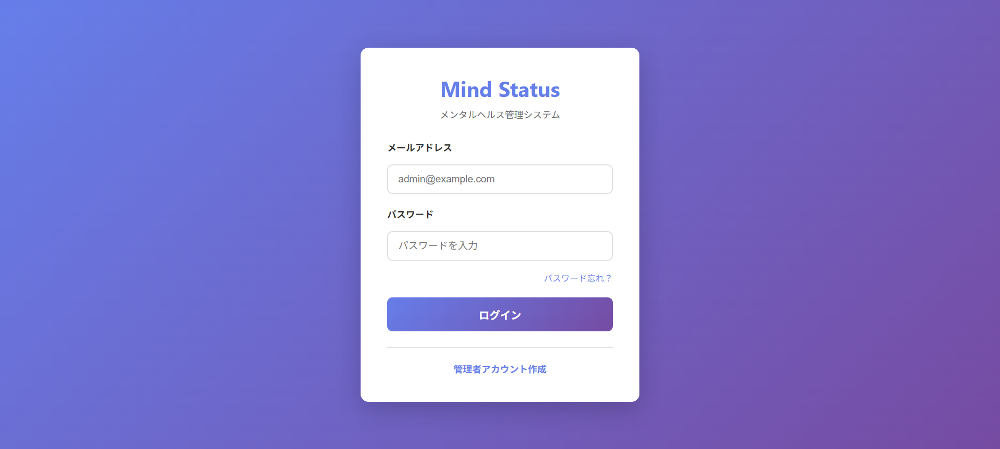
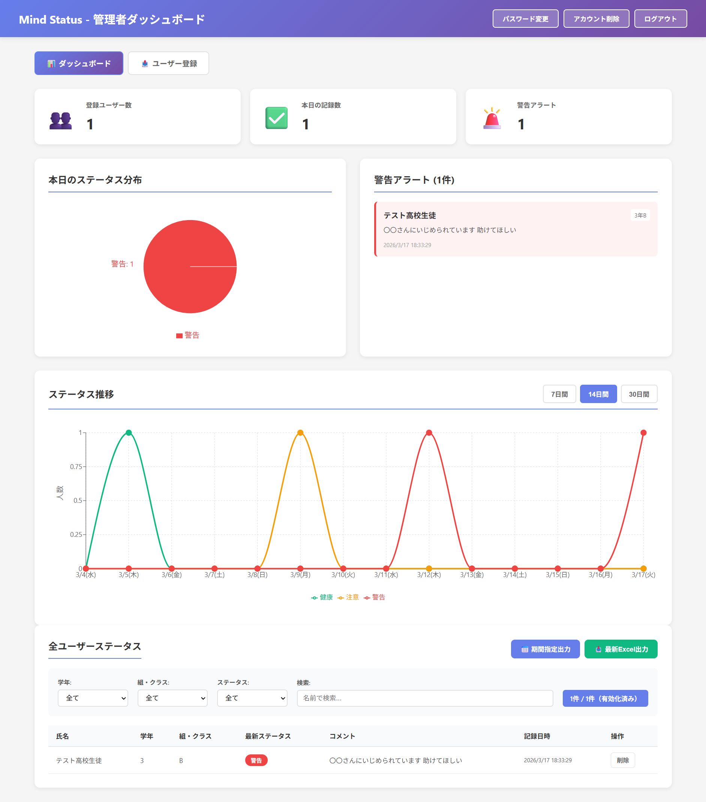
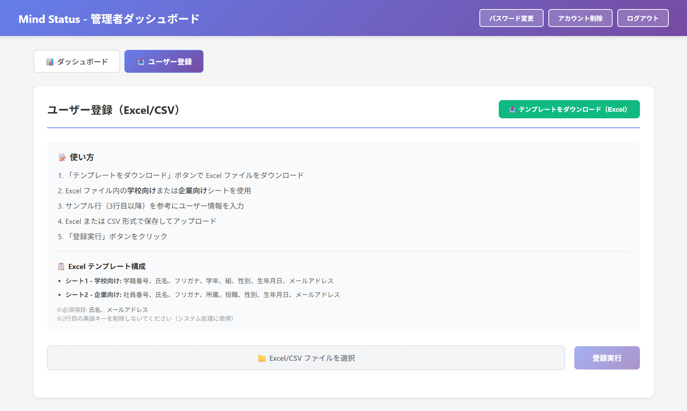
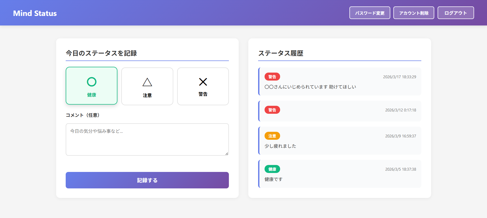

# Mind Status

**組織内メンタルヘルス管理システム**

Django REST Framework + React (TypeScript) による 
**フルスタックSPAアプリケーション**

学校や企業において、メンバー（生徒・従業員）が日々のメンタル・体調状態を記録し、  
管理者（教師・管理職）が早期に異変に気づけるWebアプリケーションです。

---

## ✨ 主な機能

### ユーザー機能

- ステータス記録（〇 / △ / ✕ + コメント）
- ステータス履歴の確認
- パスワード変更

### 管理者機能

- 組織全体の状態を可視化するダッシュボード
- Excel / CSV によるメンバー一括登録
- ステータストレンド分析
- データのExcelエクスポート

### 招待システム

- メール招待によるユーザー登録
- トークンベースの安全な招待フロー
- SendGridによるメール送信

### パスワードリセット

- トークンベースリセット
- メールによるリセットリンク送信
- 二段階検証フロー

---

## 🛠 技術スタック

### Frontend

- React 18
- TypeScript
- React Router v6
- Axios
- Recharts

### Backend

- Python
- Django
- Django REST Framework
- PostgreSQL
- JWT (SimpleJWT)
- SendGrid
- openpyxl

### Infrastructure

- Vercel (Frontend)
- Render.com (Backend + PostgreSQL)
- SendGrid (Email)
- Docker / Docker Compose

---

## 📂 ディレクトリ構成

MIND-STATUS-APP
|---.env
|---.env.example
|---.env.production.example
|---.gitattributes
|---.gitignore
|---DEPLOY.md
|---docker-compose.yml
|---README.md
|---render.yaml
|
+---backend
|   |   build.sh
|   |   Dockerfile
|   |   manage.py
|   |   requirements.txt
|   |
|   +---api
|   |   |   admin.py
|   |   |   apps.py
|   |   |   models.py
|   |   |   serializers.py
|   |   |   urls.py
|   |   |   validators.py
|   |   |   views.py
|   |   |   __init__.py
|   |   |
|   |   +---migrations
|   |   |       0001_initial.py
|   |   |       0002_alter_invitetoken_options_invitetoken_token_type_and_more.py
|   |   |       __init__.py
|   |   |
|   |   \---utils
|   |           email.py
|   |           __init__.py
|   |
|   \---config
|       |   asgi.py
|       |   urls.py
|       |   wsgi.py
|       |   __init__.py
|       |
|       +---settings
|       |   |   base.py
|       |   |   development.py
|       |   |   production.py
|       |   |   __init__.py
|       |   |
|       |   \---__pycache__
|       |           base.cpython-314.pyc
|       |           development.cpython-314.pyc
|       |           production.cpython-314.pyc
|       |           __init__.cpython-314.pyc
|       |
|       \---__pycache__
|               __init__.cpython-314.pyc
|
\---frontend
    |   Dockerfile
    |   package.json
    |   tsconfig.json
    |   vercel.json
    |
    +---node_modules
    +---public
    |       index.html
    |
    \---src
        |   App.css
        |   App.tsx
        |   index.css
        |   index.tsx
        |   react-app-env.d.ts
        |
        +---api
        |       client.ts
        |       public.ts
        |       
        +---components
        |       InviteRouteHandler.tsx
        |       StatusTrend.css
        |       StatusTrend.tsx
        |       UserBulkUpload.css
        |       UserBulkUpload.tsx
        |
        \---pages
                AdminDashboard.css
                AdminDashboard.tsx
                AdminRegisterPage.css
                AdminRegisterPage.tsx
                ChangePasswordPage.tsx
                Dashboard.css
                Dashboard.tsx
                ForgotPasswordPage.tsx
                InvitePage.css
                InvitePage.tsx
                Login.css
                Login.tsx
                ResetPasswordPage.tsx

---

## 🎯 デモ

実際に操作できるデモ環境です。

- **Frontend**: https://mind-status-app.vercel.app
- **Backend API**: https://mind-status-backend.onrender.com/api
- **Django Admin**: https://mind-status-backend.onrender.com/admin

### テストアカウント

```
管理者:
admin@example.com
Admin123!

一般ユーザー:
user@example.com
User123!
```

---

## 📱 アプリ画面

### ログイン画面


### 管理者ダッシュボード


### 一括登録


### ユーザーダッシュボード


---

## 🧠 技術的な工夫

### 1. 招待フローとパスワードリセットのトークン責務分離

```python
class InviteToken(models.Model):
    TOKEN_TYPE_CHOICES = [
        ('INVITE', '招待'),
        ('RESET', 'パスワードリセット'),
    ]
```

| 用途 | トークン |
|------|---------|
| 招待 | `INVITE` |
| パスワードリセット | `RESET` |

責務を分離することで  
**セキュリティとロジックの明確化**を実現。

---

### 2. 招待URL専用の未認証フロー

JWT認証が干渉しないように  
公開APIでは**認証を無効化**

```python
@action(
    detail=False,
    methods=['get'],
    permission_classes=[AllowAny],
    authentication_classes=[]  # JWT認証を無効化
)
```

---

### 3. Axios interceptor によるAPI認証の一元管理

```typescript
apiClient.interceptors.request.use((config) => {
  const token = localStorage.getItem("access_token");
  if (token) {
    config.headers["Authorization"] = `Bearer ${token}`;
  }
  return config;
});
```

---

### 4. React Router による公開ルート制御

招待URLなどの公開ページでは  
**認証チェックをスキップ**

```typescript
const isPublicRoute =
  location.pathname.startsWith("/invite/") ||
  location.pathname.startsWith("/reset-password/");
```

---

## 🏗 システム構成

```
Vercel (React SPA)
        │
        │ HTTPS
        ▼
Render (Django REST API)
        │
        ▼
PostgreSQL
        
SendGrid (Email)
```

---

## 💻 ローカル開発

### Clone

```bash
git clone https://github.com/your-username/mind-status-app.git
cd mind-status-app
```

### 環境変数

```bash
cp .env.example .env
```

### 起動

```bash
docker-compose up -d
```

### migrate

```bash
docker-compose exec backend python manage.py migrate
```

---

## 📦 デプロイ

### インフラ

- **Frontend** → Vercel
- **Backend** → Render
- **Database** → Render PostgreSQL
- **Email** → SendGrid

詳細は [`DEPLOY.md`](./DEPLOY.md) を参照してください。

---

## 🔮 今後の改善

### 機能

- リアルタイム通知
- グループ機能
- PDFレポート
- 多言語対応

### パフォーマンス

- Redisキャッシュ
- API最適化

### セキュリティ

- 二要素認証
- 監査ログ

---

## 👤 Author

**2026** | Portfolio project
